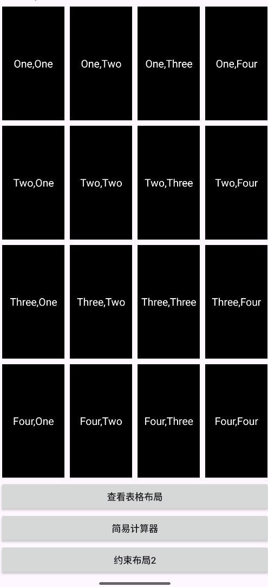

# Android布局实验文档

## 项目概述

本项目是一个Android应用，展示了多种Android布局方式的使用，包括线性布局、表格布局、约束布局等。通过实际案例演示了不同布局的特点和适用场景。

## 项目结构

```
app/src/main/
├── java/com/backmo/test1/
│   ├── MainActivity.java          # 主页面Activity
│   ├── TableActivity.java         # 表格布局Activity
│   ├── CalculatorActivity.java    # 计算器Activity
│   └── ConstraintLayout2Activity.java # 约束布局2 Activity
├── res/
│   ├── layout/
│   │   ├── activity_main.xml           # 主页面布局
│   │   ├── activity_table.xml          # 表格布局
│   │   ├── activity_calculator.xml     # 计算器布局
│   │   └── activity_constraint_layout2.xml # 约束布局2
│   └── drawable/
│       ├── double_arrows.png           # 交换箭头图标
│       ├── galaxy.png                  # 火箭星球图片
│       ├── rocket_icon.png             # 火箭图标
│       ├── rover_icon.png              # 漫游车图标
│       └── space_station_icon.png      # 空间站图标
└── AndroidManifest.xml
```

## 页面详细说明

### 1. 线性布局

**布局方式**: LinearLayout (垂直方向)

**功能特点**:
- 4x4网格布局，使用嵌套LinearLayout实现
- 每个网格项显示行列坐标（如"One,One", "One,Two"等）
- 黑色背景，白色文字
- 提供导航按钮跳转到其他页面

**技术要点**:
- 使用`layout_weight="1"`实现等分布局
- 通过`layout_margin`设置间距
- 动态添加导航按钮

**核心代码**:
```xml
<!-- 主容器 -->
<LinearLayout
    android:layout_width="match_parent"
    android:layout_height="match_parent"
    android:orientation="vertical"
    android:padding="16dp">

    <!-- 第一行 -->
    <LinearLayout
        android:layout_width="match_parent"
        android:layout_height="0dp"
        android:layout_weight="1"
        android:orientation="horizontal">

        <TextView
            android:layout_width="0dp"
            android:layout_height="match_parent"
            android:layout_margin="4dp"
            android:layout_weight="1"
            android:background="#000000"
            android:gravity="center"
            android:text="One,One"
            android:textColor="#FFFFFF"
            android:textSize="16sp" />
    </LinearLayout>
</LinearLayout>
```

展示页面布局



### 2. 表格布局页面 (TableActivity)

**布局方式**: TableLayout

**功能特点**:
- 深色主题界面
- 菜单式布局，包含多个功能选项
- 支持点击交互，显示Toast提示
- "Quit"按钮可返回主页面

**菜单项**:
- Open... (Ctrl-O)
- Save... (Ctrl-S)
- Save As... (Ctrl-Shift-S)
- X Import...
- X Export... (Ctrl-E)
- Quit

**技术要点**:
- 使用TableRow创建表格行
- 通过`android:background`设置深色主题
- 实现点击事件处理

**核心代码**:
```xml
<TableLayout
    android:layout_width="match_parent"
    android:layout_height="match_parent"
    android:background="#2C2C2C"
    android:padding="16dp">

    <!-- 标题栏 -->
    <TextView
        android:layout_width="match_parent"
        android:layout_height="wrap_content"
        android:background="#1A1A1A"
        android:gravity="center"
        android:padding="16dp"
        android:text="Hello TableLayout"
        android:textColor="#FFFFFF"
        android:textSize="18sp" />

    <!-- 菜单项 -->
    <TableRow
        android:layout_width="match_parent"
        android:layout_height="wrap_content"
        android:background="#3C3C3C"
        android:padding="12dp">

        <TextView
            android:layout_width="0dp"
            android:layout_height="wrap_content"
            android:layout_weight="1"
            android:text="Open..."
            android:textColor="#FFFFFF"
            android:textSize="16sp" />

        <TextView
            android:layout_width="wrap_content"
            android:layout_height="wrap_content"
            android:text="Ctrl-O"
            android:textColor="#CCCCCC"
            android:textSize="14sp" />
    </TableRow>
</TableLayout>
```
### 表格布局页面 (TableActivity)


### 3. 计算器页面 (CalculatorActivity)

**布局方式**: ConstraintLayout

**功能特点**:
- 绿色主题界面
- 4x4按钮网格布局
- 支持基本四则运算
- 实时显示计算结果
- 除零错误处理

**按钮布局**:
```
7  8  9  ÷
4  5  6  ×
1  2  3  +
.  0  =  -
```

**技术要点**:
- 使用ConstraintLayout实现复杂布局
- 通过`layout_weight`实现按钮等分
- 实现计算器逻辑算法
- 结果格式化显示

**核心代码**:
```xml
<androidx.constraintlayout.widget.ConstraintLayout
    android:layout_width="match_parent"
    android:layout_height="match_parent"
    android:background="#F5F5F5">

    <!-- 显示区域 -->
    <TextView
        android:id="@+id/display"
        android:layout_width="0dp"
        android:layout_height="48dp"
        android:layout_marginStart="16dp"
        android:layout_marginEnd="16dp"
        android:background="#E8F5E8"
        android:gravity="center_vertical|end"
        android:padding="12dp"
        android:text="0.0"
        android:textColor="#333333"
        android:textSize="18sp"
        app:layout_constraintEnd_toEndOf="parent"
        app:layout_constraintStart_toStartOf="parent"
        app:layout_constraintTop_toTopOf="parent" />

    <!-- 按钮容器 -->
    <LinearLayout
        android:layout_width="0dp"
        android:layout_height="0dp"
        android:orientation="vertical"
        app:layout_constraintBottom_toBottomOf="parent"
        app:layout_constraintEnd_toEndOf="parent"
        app:layout_constraintStart_toStartOf="parent"
        app:layout_constraintTop_toBottomOf="@+id/display">

        <!-- 第一行按钮 -->
        <LinearLayout
            android:layout_width="match_parent"
            android:layout_height="0dp"
            android:layout_weight="1"
            android:orientation="horizontal">

            <Button
                android:id="@+id/btn_7"
                android:layout_width="0dp"
                android:layout_height="match_parent"
                android:layout_margin="4dp"
                android:layout_weight="1"
                android:background="#E0E0E0"
                android:text="7"
                android:textColor="#333333"
                android:textSize="18sp" />
        </LinearLayout>
    </LinearLayout>
</androidx.constraintlayout.widget.ConstraintLayout>
```


### 4. 约束布局2页面 (ConstraintLayout2Activity)

**布局方式**: ConstraintLayout

**功能特点**:
- 太空主题界面
- 顶部导航标签（带图标）
- 地点选择功能（DCA ↔ MARS）
- 选项设置（One Way, 1 Traveller）
- 火箭星球背景图片
- DEPART出发按钮

**界面元素**:
- **导航栏**: Space Stations, Flights, Rovers（带对应图标）
- **地点选择**: DCA和MARS按钮，中间交换图标
- **选项**: One Way（带橙色圆点）, 1 Traveller
- **主图**: 火箭和星球图片
- **操作**: DEPART按钮

**技术要点**:
- 使用ConstraintLayout约束定位
- 图标资源集成（drawableLeft, drawableTop）
- 响应式布局设计
- 交互功能实现

**页面展示**:


## 布局技术对比

| 布局方式 | 优点 | 缺点 | 适用场景 |
|---------|------|------|----------|
| LinearLayout | 简单易用，性能好 | 嵌套复杂，不够灵活 | 简单线性排列 |
| TableLayout | 表格结构清晰 | 不够灵活，性能一般 | 表格数据展示 |
| ConstraintLayout | 灵活强大，性能好 | 学习成本高 | 复杂界面布局 |

## 图片资源说明

### 图标资源
- `space_station_icon.png`: 空间站图标，用于Space Stations导航
- `rocket_icon.png`: 火箭图标，用于Flights导航
- `rover_icon.png`: 漫游车图标，用于Rovers导航
- `double_arrows.png`: 双向箭头图标，用于地点交换功能

### 背景图片
- `galaxy.png`: 火箭和星球背景图片，用于约束布局2页面

## 开发技巧总结

### 1. 布局选择
- 简单线性排列使用LinearLayout
- 表格数据使用TableLayout
- 复杂界面使用ConstraintLayout

### 2. 图标集成
- 使用`android:drawableLeft`、`android:drawableTop`等属性
- 设置`android:drawablePadding`控制间距
- 使用`android:gravity`控制对齐方式

### 3. 响应式设计
- 使用`layout_weight`实现等分布局
- 使用`0dp`配合约束实现自适应
- 设置合适的margin和padding

### 4. 交互实现
- 使用OnClickListener处理点击事件
- 通过Toast提供用户反馈
- 实现页面间导航

## 运行说明

1. 在Android Studio中打开项目
2. 确保所有图片资源已放置在`drawable`目录
3. 运行应用，从主页面开始体验各个布局页面
4. 通过导航按钮在不同页面间切换

## 总结

本项目成功演示了Android中多种布局方式的使用，从简单的线性布局到复杂的约束布局，涵盖了实际开发中常见的布局需求。通过实际案例，展示了如何选择合适的布局方式，如何集成图片资源，以及如何实现用户交互功能。
